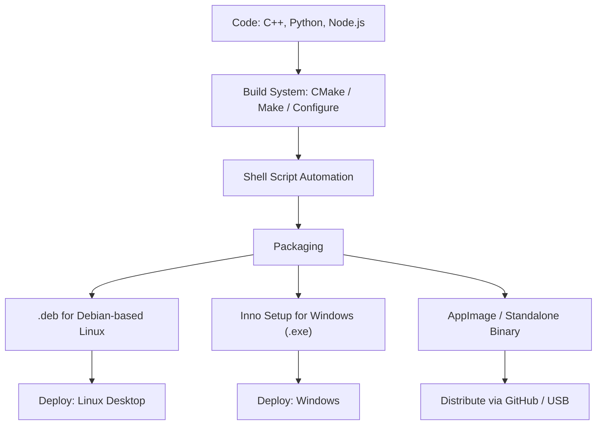

# 👋 Hi, I'm Fajar Julyana

🎯 Full-stack developer, desktop engineer, audio plugin maker, and electronics enthusiast — passionate about building efficient software and systems across platforms.
---

## 🧠 About Me

I’m a versatile developer with a broad technical skill set covering:

- **Cross-platform development** (Linux, Windows, macOS)
- **GUI Application Development**:
  - `C/C++` with `GTK3`, `Qt`, `wxWidgets`
  - `Python` with `Tkinter`, `PyQt`, `wxPython`, `Kivy`
- **Web Development**:
  - Frontend: ReactJS, Angular, TailwindCSS
  - Backend: Node.js, Flask, Django
  - Databases: PostgreSQL, MySQL, MongoDB, SQLite
- **Packaging & Deployment**:
  - Linux: `.deb` packaging, AppImage, Binary deploy
  - Windows: Inno Setup (`.exe`)
  - Tools: CMake, Make, Configure, Shell scripting
- **Audio & Plugin Development**:
  - JUCE (VST, audio plugins)
  - Delphi/Pascal with ASIO/VST (RAD Studio, Lazarus IDE)

---

## 🛠️ Hardware & Electronics

- Arduino IDE, ATmega programming (AVR, avrdude, AVR-BASP)
- Tools: Proteus ISIS, Eagle CAD, KiCAD, Fritzing
- Radio programming: Baofeng UV5R, 888s with CHIRP & official apps

---

## 🌐 SEO & Web Optimization

- Website optimization (sitemap.xml, robots.txt)
- Semantic HTML, performance tuning, accessibility

---

## 📊 System Modeling & Visualization

- Gantt Chart, ERD, DFD, Flowchart
- Tools: Mermaid syntax, LibreOffice Draw, Inkscape, GIMP

---

## 🧰 Tools & Technologies


---

## 🛠️ Build → Package → Deploy Workflow

## 🛠️ Build → Package → Deploy Workflow



## 📈 GitHub Stats (Optional)

> Aktifkan dengan mengunjungi: [github-readme-stats](https://github.com/anuraghazra/github-readme-stats)

```markdown


```

---

## 🤝 Let's Collaborate

I’m open to:

* 🔧 Open source collaboration
* 🧪 Experimental & audio tech projects
* 🎓 Mentorships or community dev
* 📬 Freelance or contract work

📧 Email: **[fajarjulyana@yandex.com](mailto:fajarjulyana@yandex.com)**
📌 Telegram / Discord / GitHub Discussions — DM me!

---

> ⚡ Powered by curiosity. Running on Arch Linux. Compiled with passion.

```


